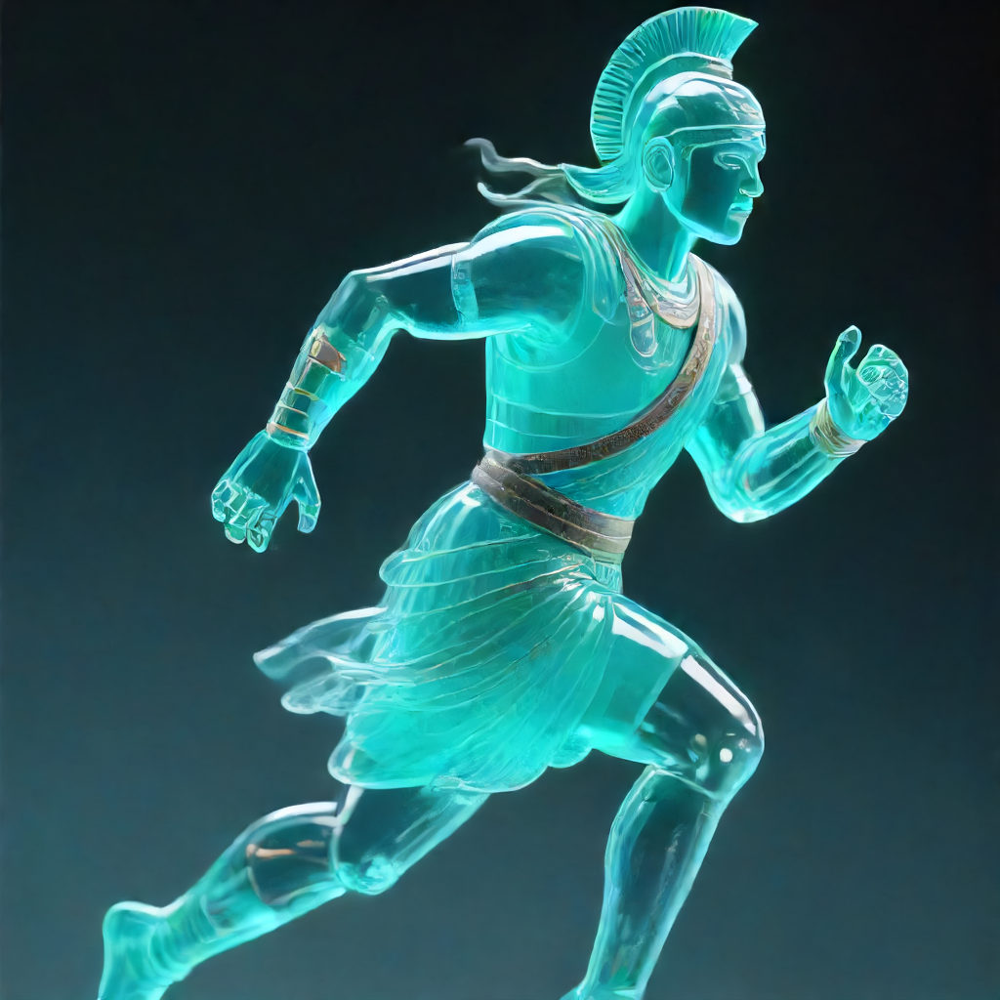

# DreamLite ComfyUI LowVRAM

Run DreamLite-base and DreamLite-mobile from ComfyUI on constrained GPUs, with a practical low-VRAM path for DreamLite-base and tiled RealESRGAN upscaling.

Canonical source: [github.com/ENUMERA8OR/dreamlite-comfyui-lowvram](https://github.com/ENUMERA8OR/dreamlite-comfyui-lowvram)

This repository does not host DreamLite or upscaler weights. It contains ComfyUI custom nodes, workflows, documentation, implementation notes, and example outputs.

This project grew out of testing DreamLite on a 4 GB GTX 1650 Ti. The main breakthrough is making DreamLite-base usable at 1024x1024 through:

```text
sequential CPU offload + float32 + GQA-aware query-token attention slicing
```

Generic Diffusers attention slicing can break DreamLite-base grouped-query attention. The bundled inference path slices the query-token dimension while preserving the grouped-query head layout.

## Results

Generated and upscaled examples from the workflow:

| DreamLite mobile | ESRGAN upscale |
|---|---|
|  |  |

| DreamLite-base | ESRGAN upscale |
|---|---|
|  |  |

More experimental outputs are kept in [Generated_Images](Generated_Images/) and raw notes are kept in [implementation_notes](implementation_notes/).

## What Is Included

- `DreamLite Base Generate V2`
- `DreamLite Mobile Generate V2`
- `DreamLite Tiled Upscale`
- A ready-to-load ComfyUI workflow:

```text
dreamlite_base_mobile_upscale_compare_workflow_v3_clean.json
```

The workflow has three lanes:

- DreamLite-base generation -> raw save -> tiled ESRGAN upscale.
- DreamLite-mobile generation -> raw save -> tiled ESRGAN upscale.
- Upload any existing image -> tiled ESRGAN upscale.

## Why This Exists

DreamLite-mobile is much easier to run, but DreamLite-base can produce different and often stronger image structure. On 4 GB VRAM, normal DreamLite-base CUDA loading fails. This repo packages the path that worked:

- keep DreamLite-base numerically stable with `float32`;
- avoid full CUDA residency with `sequential_cpu_offload`;
- reduce attention peak memory with a DreamLite-compatible GQA query slicer;
- keep upscaling usable with explicit tiled ESRGAN processing.

## Repository Layout

```text
comfyui-dreamlite-base-node/
  dreamlite_base_node.py
  scripts/infer_base_offload.py
  examples/

comfyui-dreamlite-mobile-node/
  dreamlite_mobile_node.py
  examples/

comfyui-dreamlite-upscale-node/
  dreamlite_tiled_upscale_node.py

Generated_Images/
  generated and upscaled examples

implementation_notes/
  raw local experiment notes and debugging logs
```

## Requirements

You need an existing local DreamLite checkout and local DreamLite model weights. This repository does not include model weights.

Set these before starting ComfyUI:

```bash
export DREAMLITE_PYTHON="/path/to/dreamlite/env/bin/python"
export DREAMLITE_REPO="/path/to/DreamLite"
export DREAMLITE_BASE_MODEL="/path/to/DreamLite-base"
export DREAMLITE_MOBILE_MODEL="/path/to/DreamLite-mobile"
```

Optional:

```bash
export DREAMLITE_TMP="/path/to/writable/tmp"
export DREAMLITE_TORCH_CACHE="/path/to/torch/cache"
export DREAMLITE_OFFLOAD_SCRIPT="/path/to/infer_base_offload.py"
export DREAMLITE_MOBILE_DEVICE="cuda"
export DREAMLITE_MOBILE_MEMORY_MODE="sequential_cpu_offload"
```

If `DREAMLITE_OFFLOAD_SCRIPT` is not set, the base node uses:

```text
comfyui-dreamlite-base-node/scripts/infer_base_offload.py
```

## Install

Copy or symlink the node folders into ComfyUI's `custom_nodes` directory:

```bash
ln -s /path/to/this-repo/comfyui-dreamlite-base-node /path/to/ComfyUI/custom_nodes/comfyui-dreamlite-base-node
ln -s /path/to/this-repo/comfyui-dreamlite-mobile-node /path/to/ComfyUI/custom_nodes/comfyui-dreamlite-mobile-node
ln -s /path/to/this-repo/comfyui-dreamlite-upscale-node /path/to/ComfyUI/custom_nodes/comfyui-dreamlite-upscale-node
```

Restart ComfyUI after setting the environment variables.

Then load:

```text
dreamlite_base_mobile_upscale_compare_workflow_v3_clean.json
```

## Recommended Settings

For a 4 GB GPU, the strongest tested DreamLite-base profile was:

```text
memory_mode: sequential_cpu_offload
dtype: float32
attention_mode: gqa_query_slicing
attention_slice_size: 256
resolution: 1024x1024
steps: 26-30
```

DreamLite-mobile starting point:

```text
steps: 4
resolution: 1024x1024
dtype: bfloat16
```

Tiled ESRGAN starting point:

```text
tile_size: 256
overlap: 32
output_device: cpu
```

## Upscaling Existing Images

The workflow includes an independent upload lane:

```text
Load Image -> UpscaleModelLoader -> DreamLite Tiled Upscale -> SaveImage
```

Use this lane when you want to upscale any existing image without running DreamLite generation first.

Place ESRGAN or RealESRGAN-compatible weights in:

```text
ComfyUI/models/upscale_models
```

The tested model was:

```text
RealESRGAN_x4plus.pth
```

## Notes

- This repo does not include DreamLite model weights.
- This repo does not include upscaler weights.
- `implementation_notes/` intentionally preserves raw experiment notes. Some notes may mention local machine paths; they are not installation instructions.
- DreamLite, ComfyUI, model checkpoints, and upscaler checkpoints are separate projects with their own licenses.

## License

Apache-2.0. See [LICENSE](LICENSE) and [NOTICE](NOTICE).
